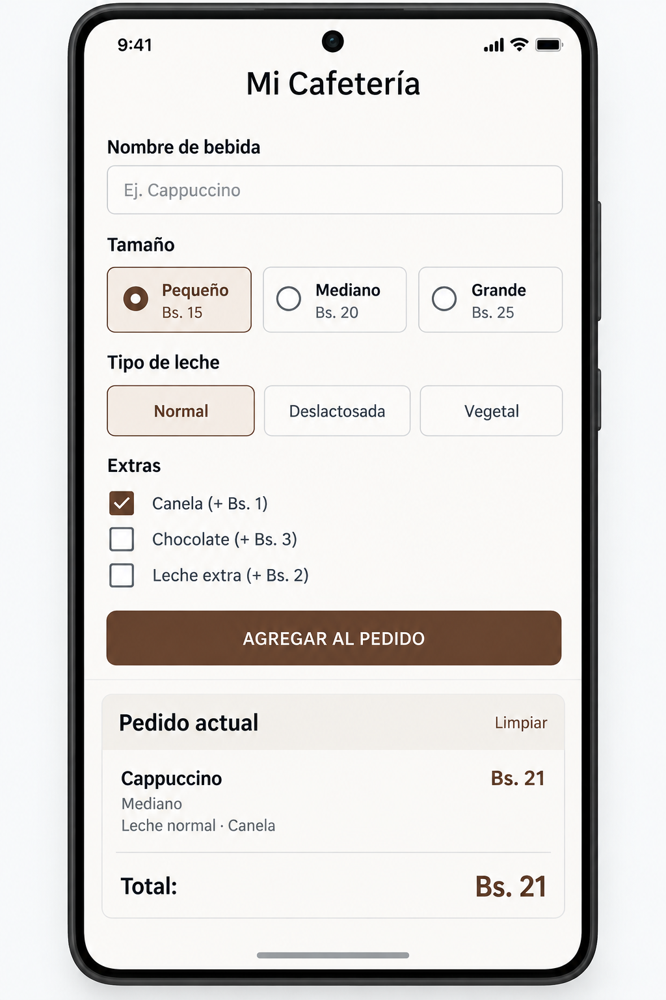

# Programación de Aplicaciones Móviles I — Examen Práctico

## Duración

**100 minutos**

## Objetivo

Construir una aplicación Android utilizando **Kotlin y Jetpack Compose** que
permita configurar una bebida de café y agregarla al pedido actual.

La aplicación debe tomar como referencia la siguiente interfaz:

No es necesario que la interfaz sea idéntica píxel por píxel. Se evaluará que
la distribución y los elementos principales sean equivalentes.

---

## Requerimientos

### 1. Pantalla principal

La aplicación debe contar con una única pantalla principal llamada
**"Mi Cafetería"**.

La pantalla debe organizar los elementos de forma similar a la imagen de
referencia, utilizando los componentes básicos de Jetpack Compose necesarios
para construir la interfaz.

### 2. Nombre de la bebida

Debe existir un campo de texto donde el usuario pueda ingresar el nombre de
la bebida que desea agregar al pedido.

### 3. Selección del tamaño

El usuario debe poder seleccionar uno de los siguientes tamaños:

- Pequeño
- Mediano
- Grande

Solo un tamaño puede estar seleccionado al mismo tiempo.

### 4. Selección del tipo de leche

El usuario debe poder seleccionar uno de los siguientes tipos de leche:

- Normal
- Deslactosada
- Vegetal

Solo un tipo de leche puede estar seleccionado al mismo tiempo.

### 5. Selección de extras

El usuario debe poder seleccionar o deseleccionar independientemente los
siguientes extras:

- Canela
- Chocolate
- Leche extra

Es posible seleccionar varios extras simultáneamente.

La interfaz debe reflejar inmediatamente qué extras están seleccionados.

### 6. Precio según el tamaño

El precio base de la bebida depende del tamaño seleccionado:

| Tamaño  | Precio |
| ------- | -----: |
| Pequeño | Bs. 15 |
| Mediano | Bs. 20 |
| Grande  | Bs. 25 |

El precio debe cambiar automáticamente cuando el usuario cambie el tamaño.

### 7. Precio de los extras

Cada extra seleccionado debe aumentar el precio de la bebida:

| Extra       | Precio adicional |
| ----------- | ---------------: |
| Canela      |          + Bs. 1 |
| Chocolate   |          + Bs. 3 |
| Leche extra |          + Bs. 2 |

Los extras que no estén seleccionados no deben modificar el precio.

Por ejemplo:

**Grande + Chocolate + Canela = Bs. 29**

### 8. Precio total

La pantalla debe mostrar siempre el precio total correspondiente a las
opciones seleccionadas actualmente.

El usuario debe poder cambiar el tamaño o los extras y observar cómo el
precio se actualiza.

### 9. Botón "AGREGAR AL PEDIDO"

Debe existir un botón con el texto:

**AGREGAR AL PEDIDO**

Al presionarlo, la aplicación debe tomar la información actualmente
seleccionada y convertirla en el pedido actual.

### 10. Pedido actual

La pantalla debe contar con una sección llamada:

**Pedido actual**

Después de agregar una bebida, esta sección debe mostrar como mínimo:

- Nombre de la bebida.
- Tamaño seleccionado.
- Tipo de leche seleccionado.
- Extras seleccionados.
- Precio total.

Los datos mostrados deben corresponder a la última bebida agregada.

### 11. Botón "LIMPIAR"

La sección **Pedido actual** debe contar con una opción para limpiar el pedido.

Al presionar **LIMPIAR**:

- El pedido actual debe desaparecer.
- La sección debe volver a su estado inicial.
- El formulario puede conservar las opciones actualmente seleccionadas.

### 12. Validación del nombre

No se debe permitir agregar un pedido si el nombre de la bebida está vacío.

En este caso, se debe informar al usuario que debe ingresar un nombre antes
de agregar el pedido.

### 13. Validación del tamaño

No se debe permitir agregar un pedido si no se ha seleccionado un tamaño.

En este caso, se debe informar al usuario que debe seleccionar un tamaño antes
de agregar el pedido.

### 14. Funcionamiento de la interfaz

Los cambios realizados por el usuario deben reflejarse inmediatamente en la
interfaz.

Por ejemplo:

- Al seleccionar otro tamaño, debe cambiar el precio.
- Al seleccionar un extra, debe aumentar el precio.
- Al deseleccionar un extra, debe disminuir el precio.
- Al cambiar una opción, la selección anterior debe actualizarse correctamente.
- Al agregar el pedido, la sección "Pedido actual" debe mostrar los nuevos
  datos.
- Al limpiar el pedido, la sección "Pedido actual" debe quedar vacía.

---

## Restricciones técnicas

La solución debe desarrollarse utilizando:

- Kotlin
- Android
- Jetpack Compose
- Componentes básicos de Compose

No utilizar:

- ViewModel
- Room
- Retrofit
- Hilt
- Navigation
- Servicios backend
- Almacenamiento persistente
- Librerías externas de UI
